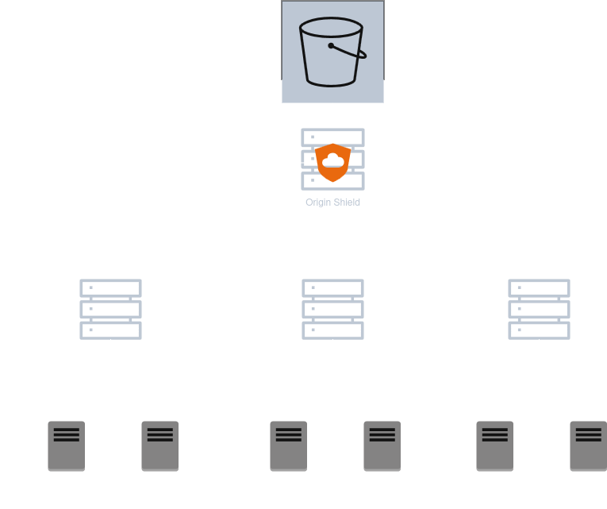

# Content Caching Strategies in CDN

## Push CDN
- Origin Server -> CDN system
- API used -> The Deliver API
- Content provider is the active manager in this model and is responsible for content update in CDNs.
- Best for Static content because these do not expire frequently and do not need to be pulled from Origin again and again.
- Drawback - Inefficient for rapidly changing content because they will be large in number and the origin server has to alone manage the update, instead of CDN who distribute the load among themselves in a  pull model.

## Pull CDN (TTL for expiry)
- CDN system request -> Origin server
- API used -> The retrieve API
- Responsibility of latest data on the CDN system using TTL
- Best for frequently changing / dynamic data as the high load is being handled by a distributed CDN system as opposed to the origin servers.
- Might be slower but is cheaper. Slowness comes from the fact that a network call might be required for a expired or uncached content.

### Dynamic Content caching optimization / Features in a CDN

#### Edge scripting
- We can run scripts on edge servers to generate dynamic content based on the end users location, time, status ..etc

#### Compression
- Tools like Cloudflare's Railgun compresses dynamic content to reduce bandwidth usage between the orginn and proxy servers.

#### ESI - Edge Side Includes
- A markup language used in a CDN where the pages are divided into static and dynamic bits and only dynamic content is fetched from origin server and hence avoids the re-fetching of entire web pages.

##### Note: DASH (Dynamic Adaptive Streaming over HTTP) uses a manifest file which defines which URI to fetch based on network condition. Netflix uses a private / proprietry version of DASH.

## Multi-tier CDN architecture

- Instead of caching all the content in a single server we use a group of servers layed out in a herarchical / tierwise distribution.
- Edge tier CDN (acts like a RAM) - These are heighest in number but per server the storage used is a fast performance low storage. Whether the total capacity of this tier is more than the upper tiers is dependent on the architecture but most of the time it is lower s we go down the tree towards the edge servers.
- Mid tier Ingress servers (acts like a SSD) - They handle the less accessed content as compared to the edge server but more popular than the origin. 
- Origin / Capacity tier servers (acts like a HDD) - They are the Source of truth and contain all the data and never evict anything
- Request is always served via the edge servers. If we allow users to directly go to higher tiers we run the risk of burning the higher tiers because they take more time per connection and are also less in number as compared to the edge tiers. The data is streamed through layers and simultaneously saved if required. 
- (Exclusive cache) Most of the time engineers decide to not store the data duplicates between layers. (except the origin which is a SSOT)
- (Inclusive cache) All the layers do store the data but will evict them. This wastes space and hence not used most of the times.
- Origin Shield - A origin shield is like a mega cache tier placed directly after the origin, if any CDNs in the world has requested that data recently the origin shield layer would have it.
- The data out from cold storage / origin is expensive and the architecture is designed in a way to minimize this.
\
## Multi - Tier CDN architecture
\
\

## How to chose the nearest edge / proxy CDN servers
- Network distance - 2 things into account
    - Length of the network path (directly proportional)
    - Bandwidth (capacity) available for that network path (innversely proportional)
- Request Load - referes to the load that a proxy server is handling currently, if a proxy server is already overwhelmed, the routing system should redirect to the next nearest proxy server.

### DNS Redirection 
- Clients first resolve the CDN auth DNS ip address from DNS servers
- Then they reach out to CDN auth DNS to resolve a URI 
- The CDN DNS load balances and takes into consideration which proxy server has what load and returns the ip address and ttl to the user / client
- The user reaches out to the specifc proxy server / edge server and fetches the content.
- The user again asks the CDN auth DNS once the ttl expires and hence load balancing is achived between many servers.

#### Anycast
- All the edge servers are given the same IP address which they advertise and the DNS automatically redirects users to their closest proximity edge server.

#### Client Multiplexing
- The client is sent a list of ip address to choose from
- The client decides which proxy server to reach out to, the approach is inefficient because the overall context like distance, bandwidth, th load on those servers are not available.

#### HTTP redirection
- Simplest of all redirection approaches.
- The client recieves a 302 redirection with a Location for CDN.
- The client follows the Location and is able to fetch the content.